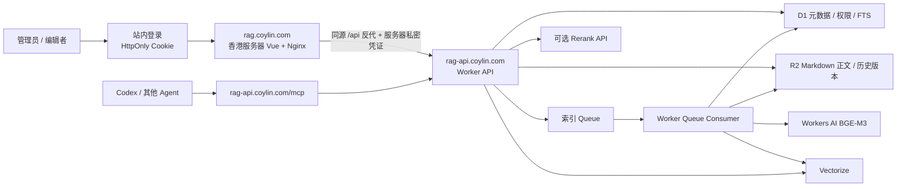

# AI 大脑知识库（Cloudflare Workers 版）项目计划

> 版本：v1.4<br>
> 更新日期：2026-08-10<br>
> 技术栈：Vue 3 + TypeScript + Hono + Cloudflare Workers + R2 + D1 + Vectorize + Queues + MCP

> 二期的五项安全增强（回收站、最高权限 Token 风控、版本 Diff/回滚、来源时效、Markdown 导入导出）已拆成独立实施路线图，见 [ROADMAP_5_FEATURES.md](./ROADMAP_5_FEATURES.md)。路线图目前仅为规划，不代表功能已经实现或部署。

## 1. 项目定位

本项目不是单纯的“上传文件后问答”系统，而是一个可供人和 AI Agent 共同使用的长期知识中枢。

- **知识库主体**：Markdown 文档、版本、权限、审核和审计。
- **RAG 能力**：把相关知识片段检索出来，供模型生成答案时引用；它是知识库的一项能力，不是整个系统。
- **MCP 接口**：让 Codex、Claude Code 等 Agent 以标准协议搜索、读取、提议记忆；受信任 Agent 可使用单独的最高权限 Token 直接维护知识。
- **网页管理端**：供人维护文档、成员、Token、索引任务和 Agent 记忆提案。

第一版优先保证：资料可控、来源可追溯、Agent 易接入、低运维成本。Markdown 是唯一的正文格式，R2 是正文的事实来源。

## 2. 关键决策

| 项目 | 决策 | 原因 |
| --- | --- | --- |
| 后端运行平台 | Cloudflare Workers | 适合请求驱动的管理 API、MCP 和异步索引 |
| 管理前端 | Vue 3 + TypeScript + Vite，部署到香港服务器 | 静态托管资源占用低，可与现有服务器统一运维 |
| 生产域名 | `rag.coylin.com` + `rag-api.coylin.com` | 前端域名保持 DNS only，MCP 使用独立入口和 Token |
| Markdown 正文 | R2 | 适合对象存储、成本低、天然保存不可变版本 |
| 元数据与权限 | D1 | 适合关系数据、筛选、审计和事务 |
| 全文检索 | D1 FTS5 trigram | 支持中文关键词检索，作为混合检索的一路召回 |
| 语义检索 | Vectorize | 托管向量索引，不需要自建向量数据库 |
| 异步索引 | Cloudflare Queues | 保存文档不等待切块、Embedding 和向量写入 |
| Agent 接入 | 专属 Streamable HTTP MCP | 工具边界、Token 权限和返回格式由本系统控制 |
| 管理端登录 | 站内邮箱密码 + HttpOnly Cookie | 不依赖橙云或浏览器 Basic Auth，适配 DNS only 部署 |
| Embedding | Workers AI `@cf/baai/bge-m3` | 原生 binding、1024 维、多语言，无需管理单独 API Key |
| Rerank | 可选 OpenAI 兼容接口 | 未配置或不可用时自动保留 RRF 排序 |

### Workers 与云服务器的结论

MVP 后端采用 Workers，计算、R2、D1、Vectorize 和 Queue 都使用托管服务；Vue 静态文件部署到香港服务器的 Nginx。前端本身不运行 Node.js，增量内存通常只有几十 MiB；已有服务器可直接复用，若购买专用主机则 512 MiB 能运行，建议 1 GiB 以给系统更新、日志和 TLS 留余量。若以后出现超长后台任务、复杂文档转换、本地模型推理或持续运行进程，再把“索引 Worker”单独迁到云服务器。

## 3. 总体架构



Worker 只承载后端，通过 Custom Domain `rag-api.coylin.com` 暴露 `/api/v1/*`、`/mcp` 和 `/healthz`。Vue 部署在 `rag.coylin.com`，浏览器只访问同源 `/api/*`，由 Nginx 原样反代路径并注入仅服务器持有的代理凭证。管理 API 同时验证代理凭证与签名会话 Cookie；MCP 使用自己的 Bearer Token 鉴权。

## 4. 数据与文件设计

### 4.1 R2 对象结构

```text
notes/{collectionId}/{noteId}/current.md
versions/{collectionId}/{noteId}/{version}.md
proposals/{collectionId}/{proposalId}.md
```

- `current.md`：当前版本的便捷副本。
- `versions/.../{version}.md`：不可变历史版本，用于恢复和审计。
- `proposals/...`：Agent 提交、尚未进入正式知识库的记忆提案。
- R2 不开放公共读取，所有访问都经过 Worker 权限校验。

### 4.2 Markdown 规范

```markdown
---
id: 由系统生成的 UUID
title: 文档标题
tags:
  - 项目
  - 规范
status: published
version: 1
---

# 文档标题

正文内容……
```

- 必须包含 YAML frontmatter。
- `title` 必填；`tags` 最多 20 个；`status` 为 `draft` 或 `published`。
- `id` 和 `version` 由服务端维护，客户端不能篡改文档身份。
- 单篇 Markdown 上限 2 MiB；图片等附件作为后续版本能力，不进入 MVP。

### 4.3 D1 职责

D1 保存知识库、成员角色、文档元数据、历史版本指针、切块、FTS 索引、索引任务、MCP Token、记忆提案和审计日志。D1 不作为 Markdown 正文的唯一存储，避免正文和历史版本挤在关系库内。

### 4.4 Vectorize 约束

- 当前向量维度固定为 1024，创建索引和选择 Embedding 模型时必须一致。
- 向量 metadata 至少带 `collection_id`、`note_id`、`version`，检索必须先做知识库范围过滤。
- 更换 Embedding 模型时新建索引版本并全量重建，不能直接混用旧向量。

## 5. 核心流程

### 5.1 文档写入与索引

1. 用户在网页端新建或编辑 Markdown。
2. Worker 校验管理会话、知识库角色、frontmatter 和版本号。
3. 正文写入 R2，新版本元数据写入 D1。
4. Worker 创建索引任务并投递 Queue，立即响应网页端。
5. Queue Consumer 按标题层级切块，每块约 1500 字符并保留约 150 字符重叠。
6. Consumer 调用 Embedding 接口，写入 Vectorize，同时更新 D1 chunks 和 FTS。
7. 成功后把 `indexed_version` 指向当前版本；失败则记录原因并按策略重试。

只有 `published` 且索引完成的版本能被 Agent 检索。任务以 `noteId + version` 保持幂等，旧任务不能覆盖新版本。

### 5.2 混合检索

1. 校验 Token 能访问的 `collectionIds`。
2. 并行执行 D1 FTS 关键词召回和 Vectorize 语义召回，各取前 30 条。
3. 使用 RRF 合并两路结果并按标签过滤。
4. 如已配置 Rerank，重排前 20 条；服务不可用时自动使用 RRF 结果。
5. 返回文档标题、标题路径、摘要、分数、版本和 `kb://` 引用 URI。

回答生成不放在本系统中。Agent 取得可靠上下文后，使用自己当前的模型回答，从而避免重复承担模型网关职责。

### 5.3 Agent 写入

系统提供两条明确分离的写入路径：

1. 普通 Agent 使用 `memory:propose` 生成待审核提案；管理员查看来源、接受或拒绝，接受后才生成正式 Markdown 并进入索引。
2. 受信任 Agent 使用单独的 `knowledge:admin` Token 直接 CRUD 知识库与 Markdown。集合更新使用 `updated_at` 乐观锁，文档更新使用版本号乐观锁；删除必须同时匹配当前版本及精确名称/标题，所有操作按 Token 身份写入审计。

`knowledge:admin` 只代表“最高知识权限”，不包含 Token、成员、管理员账号或登录配置管理，也不能给自己提权。它只能由 bootstrap 管理员创建和撤销，默认建议 24 小时内过期。

## 6. MCP 设计

入口：`POST /mcp`，使用 Bearer Token，并采用 Streamable HTTP 协议。

| MCP 能力 | 类型 | 用途 | Scope |
| --- | --- | --- | --- |
| `list_collections` | Tool | 列出 Token 可访问的知识库 | `knowledge:read` |
| `list_notes` | Tool | 列出最近更新的已发布文档 | `knowledge:read` |
| `list_recent_changes` | Tool | 增量获取指定时间后的变更 | `knowledge:read` |
| `search_knowledge` | Tool | 混合检索并返回可引用片段 | `knowledge:read` |
| `read_note` | Tool | 读取完整 Markdown | `knowledge:read` |
| `propose_memory` | Tool | 提交待人工审核的长期记忆 | `memory:propose` |
| `create_collection` | Tool | 创建知识库并保留签发者为人类管理员 | `knowledge:admin` |
| `update_collection` | Tool | 使用 `updated_at` 乐观锁修改知识库 | `knowledge:admin` |
| `delete_collection` | Tool | 精确名称确认后删除空知识库 | `knowledge:admin` |
| `create_note` | Tool | 创建草稿或正式 Markdown | `knowledge:admin` |
| `update_note` | Tool | 使用当前版本号更新 Markdown | `knowledge:admin` |
| `delete_note` | Tool | 当前版本和精确标题确认后软删除 | `knowledge:admin` |
| `kb://collections/{collectionId}/notes/{noteId}` | Resource Template | 以资源 URI 读取当前 Markdown | `knowledge:read` |

Token 只展示一次明文，服务端只保存哈希。普通 Token 必须限定知识库、Scope 和可选过期时间；`knowledge:admin` 不保存固定 `collectionIds`，运行时覆盖所有当前及未来知识库，并且不能与其他 Scope 混用。不同 Agent、设备和任务分别创建 Token，便于撤销、归因和审计。

## 7. 网页管理端范围

### MVP 页面

- 知识库：创建知识库、切换知识库、成员和角色管理。
- 文档：列表、Markdown 编辑、预览、标签、草稿/发布、删除。
- 历史版本：查看版本并恢复，写入时使用乐观锁避免覆盖并发修改。
- 检索调试：输入查询、知识库、标签和返回数量，查看命中路径和分数。
- 提案审核：查看 Agent 来源与内容，批准或拒绝。
- MCP Token：创建、查看范围、撤销和过期管理。
- 索引任务：查看排队、处理中、成功、失败状态并按权限重试。

### 暂不进入 MVP

- PDF、Office、网页抓取和 OCR。
- 实时多人协作编辑。
- 对话 UI 和模型回答生成。
- 自动接受 Agent 记忆。
- 公共知识库、匿名分享和开放注册。
- Obsidian 双向实时同步；后续可增加导入/导出 ZIP 或 Git 同步。

## 8. 权限与安全

### 人员角色

| 操作 | Viewer | Editor | Admin |
| --- | :---: | :---: | :---: |
| 查看和搜索 | 是 | 是 | 是 |
| 新建、编辑、恢复、重建索引 | 否 | 是 | 是 |
| 管理成员、Token、审核提案 | 否 | 否 | 是 |

### Agent Token Scope

| Scope | 知识范围 | 允许操作 |
| --- | --- | --- |
| `knowledge:read` | 明确选择的知识库 | 列表、搜索、读取已发布 Markdown |
| `memory:propose` | 明确选择的知识库 | 提交待人工审核的记忆提案 |
| `knowledge:admin` | 所有当前及未来知识库 | 知识库与 Markdown CRUD、读取草稿、提交提案；不含 Token、成员和账号管理 |

### 安全要求

- 管理员通过站内邮箱密码登录，密码只以 SHA-256 值保存在 Worker Secret 中。
- 会话 Cookie 必须为 `HttpOnly`、`Secure`、`SameSite=Strict`，有效期 12 小时。
- Nginx 将同源 `/api/*` 原样反代到 Worker，并注入服务器私密代理凭证；Worker 同时验证代理凭证和会话签名。
- 生产环境所有非只读管理请求必须校验 `Origin`，登录接口在 Nginx 侧按 IP 限速。
- MCP 采用独立 Bearer Token，不复用浏览器管理会话。
- `rag.coylin.com` 保持 DNS only，由 Nginx 和 Let's Encrypt 直接提供 HTTPS。
- 所有 D1、R2、Vectorize 查询必须先限定知识库授权范围。
- 创建、编辑、删除、恢复、审核、Token 操作和任务重试写入审计日志。
- API Key 使用 `wrangler secret put`，不得放进 `wrangler.jsonc` 或 Git。
- R2 Bucket、D1 和 Vectorize 不提供绕过 Worker 的公网入口。
- API 返回统一错误码和 `requestId`，日志中不得输出完整 Token 或第三方 API Key。

## 9. Cloudflare 资源与运行要求

需要创建以下资源：

- 1 个 Worker：`knowledge-core`
- 1 个 R2 Bucket：`knowledge-core-notes`
- 1 个 D1 Database：`knowledge-core-db`
- 1 个 1024 维 Vectorize Index：`knowledge-core-v1`
- 1 个 Vectorize `collection_id` 字符串 metadata index，用于服务端知识库范围过滤
- 1 个 Queue：`knowledge-core-index`
- 1 个 Dead Letter Queue：`knowledge-core-index-dlq`
- 1 台香港服务器上的 Nginx，用于 Vue 静态文件和 `/api/*` 反向代理

Worker 后端没有“给服务器分配多少内存”的配置，持久数据放在托管存储里。香港服务器只托管 Nginx 和 Vue 静态文件：复用现有服务器时无需单独预留，专用服务器最低 512 MiB、建议 1 GiB。开发电脑最低可按 4 GB 可用内存运行，推荐 8 GB 以上。

免费额度和产品可用范围会随 Cloudflare 套餐调整，正式上线前按账号控制台和官方 Limits 页面核对。计划以“单人或小团队、纯 Markdown、低频增量索引”为免费版 MVP 使用假设，并设置以下保护：

- 搜索一次最多 10 个知识库、返回最多 8 条。
- 单次 Queue batch 最多处理 5 条消息。
- 文档保存仅对新版本重新索引。
- MCP Token 使用最小知识库与 Scope；最高权限 Token 使用独立短有效期凭证；速率限制列入二期，生产异常告警在上线阶段配置。
- 监控 R2 容量、D1 行数、向量数、Queue backlog、Worker 请求量及第三方模型费用。

## 10. 环境配置

| 变量 | 用途 | 配置方式 |
| --- | --- | --- |
| `BOOTSTRAP_ADMIN_EMAILS` | 首批全局管理员 | 普通变量，稳定后清理 |
| `ADMIN_LOGIN_EMAIL` | 站内管理员登录邮箱 | 普通变量 |
| `ADMIN_ORIGIN` | 允许管理写请求的前端 Origin | 普通变量 |
| `ADMIN_PROXY_SECRET` | Nginx 到 Worker 的共享凭证 | Secret |
| `ADMIN_LOGIN_PASSWORD_HASH` | 初始密码的 SHA-256 | Secret |
| `ADMIN_SESSION_SECRET` | 会话 HMAC 签名密钥 | Secret |
| `EMBEDDING_MODEL` | 默认 `@cf/baai/bge-m3` | 普通变量 |
| `EMBEDDING_BASE_URL` | 可选外部 Embedding 地址 | 普通变量 |
| `EMBEDDING_API_KEY` | 仅外部 Embedding 使用 | Secret |
| `RERANK_BASE_URL` | 可选重排服务地址 | 普通变量 |
| `RERANK_MODEL` | 可选重排模型 | 普通变量 |
| `RERANK_API_KEY` | 可选重排密钥 | Secret |

本地使用 `.dev.vars`，生产密钥使用 Wrangler Secret。开发环境可使用确定性的伪向量完成流程测试，但不能用它评估真实检索质量。

## 11. 实施阶段

### 阶段 A：工程与基础设施（已完成）

- [x] Vue、TypeScript、Vite、Hono 和 MCP SDK 工程骨架。
- [x] Worker API、MCP、Queue 和定时任务入口。
- [x] R2、D1、Vectorize、Queue 绑定和 D1 初始迁移。
- [x] 管理代理身份和知识库角色模型。

### 阶段 B：知识与检索闭环（已完成）

- [x] Markdown frontmatter 校验、R2 版本和乐观锁。
- [x] 标题感知切块、Embedding、Vectorize 和 FTS 索引。
- [x] FTS + Vectorize + RRF + 可选 Rerank 混合检索。
- [x] 异步任务、重试、幂等和审计。

### 阶段 C：网页与 MCP（已完成）

- [x] 知识库、成员、编辑预览、版本恢复和索引任务页面。
- [x] 检索调试、提案审核和 MCP Token 页面。
- [x] 普通 Token 的 6 个 MCP Tools、最高权限 Token 的 6 个 CRUD Tools，以及 1 个 Resource Template。
- [x] Agent 记忆提案进入人工审核流程。
- [x] 增加只能由 bootstrap 管理员签发的 `knowledge:admin`，并为集合/文档更新、删除和审计设置安全边界。

### 阶段 D：质量收口（已完成）

- [x] 修复文档保存/恢复后的编辑器状态和页面卸载事件监听器。
- [x] 统一 `If-Match`、版本冲突等 API 错误响应。
- [x] 验证中文 FTS `MATCH` SQL 和短查询回退。
- [x] 将单任务重试严格限制到调用者可管理的知识库。
- [x] 加固并发版本写入、旧索引任务、Queue 重投和提案并发批准。
- [x] 增加 frontmatter、切块、哈希、权限、RRF、检索、Queue 和 MCP 合约测试。
- [x] 建立当前测试基线：7 个测试文件、31 个测试通过，`pnpm typecheck` 通过。
- [x] 执行最新本地 D1 migrations，并用 Wrangler 跑通 D1、R2、Queue、API 和 MCP。
- [x] 增加 Playwright 关键流程测试。
- [x] 检查桌面和 375 px 移动端交互、页面级横向溢出与按钮命中区域。
- [x] 完成双域名部署说明、环境变量示例、站内登录规则和 Codex MCP 接入说明。
- [x] 执行最终 `pnpm test`、`pnpm typecheck`、`pnpm build` 和 `pnpm test:e2e`。

### 阶段 E：Cloudflare 上线（预计 0.5–1 人日）

- [x] 创建生产 D1、R2、Vectorize、`collection_id` metadata index、主 Queue 和死信 Queue。
- [x] 替换 `wrangler.jsonc` 中真实 D1 资源 ID，并执行远程 D1 migrations。
- [x] 绑定 Workers AI BGE-M3，消除外部 Embedding 配置依赖。
- [x] 配置首位管理员 `admin@coylin.com` 和 Nginx 管理代理认证。
- [x] 部署 Worker 并绑定 `rag-api.coylin.com` 自定义域名。
- [x] 部署 Vue 和 Nginx 到香港服务器。
- [x] 配置 `rag.coylin.com` DNS only、HTTPS 和自动续期。
- [x] 使用站内登录和 HttpOnly Cookie 替换 Nginx Basic Auth。
- [ ] 创建首个知识库、管理员和只读 MCP Token。
- [ ] 在 Codex 中连接 MCP，完成搜索、整篇读取、引用和记忆提案验收。
- [ ] 配置错误率、Queue 积压和模型调用异常的告警。

### 推荐执行顺序

1. **本地数据层**：应用全部 migrations，确认空库初始化和重复执行行为。
2. **本地闭环**：启动 Worker 与 Vue，创建知识库和 Markdown，观察 Queue 完成索引，再通过 MCP 搜索和读取。
3. **网页验收**：用 Playwright 覆盖登录后的文档创建、编辑、恢复、检索、Token 和提案审核流程。
4. **生产资源**：创建 D1、R2、Vectorize、Queue 和 DLQ，写入真实绑定与 Secrets。
5. **安全上线**：先部署 Worker 和 `rag-api.coylin.com`，再部署 Vue/Nginx，写入会话与代理 Secrets，关闭开发身份绕过并验证登录限速。
6. **Agent 验收**：让 Codex 使用只读 Token 完成检索和引用，再使用提案权限验证人工审核闭环。
7. **运行观察**：首周关注请求错误率、Queue backlog、Embedding 失败率、D1/Vectorize 用量和费用。

### 阶段 F：二期增强（按实际需要）

五项已选增强的依赖、迁移、接口和验收细节以 [ROADMAP_5_FEATURES.md](./ROADMAP_5_FEATURES.md) 为准；实现顺序不是下面清单的展示顺序。

- [ ] Markdown ZIP/Git 导入导出与 Obsidian 工作流。
- [ ] 附件、图片和文档间双向链接。
- [ ] 搜索评测集、命中反馈和模型版本对比。
- [ ] 版本差异、归档/保留策略和按 Token 的操作/用量统计。
- [ ] 事实级来源、矛盾检测、失效规则与时间知识图谱试验。
- [ ] Token 速率限制、IP 策略和更细粒度审计查询。
- [ ] 当数据规模或任务时长超出 Workers 边界时拆分独立索引服务。

## 12. 上线验收标准

功能验收：

- 管理员可创建知识库、分配角色、创建和恢复 Markdown 版本。
- 保存后异步索引可见，失败任务可定位并在授权范围内重试。
- 中文精确词、语义近义词和标签过滤均能返回正确知识库中的结果。
- 无权用户和无权 Token 不能通过猜测 ID 读取、搜索或重试其他知识库资源。
- Codex 可通过 MCP 列出知识库、搜索片段、读取完整 Markdown 并提交提案。
- Agent 提案在管理员批准前不会进入正式搜索结果。
- 最高权限 Token 可完成知识库和 Markdown CRUD；普通 Token 看不到写工具，非 bootstrap 管理员不能创建、查看或撤销最高权限 Token。
- Agent 更新遇到旧 `updated_at`/版本号时返回冲突，删除确认不一致时不得改变数据，审计记录必须归因到具体 Token。

工程验收：

- `pnpm test`、`pnpm typecheck` 和 `pnpm build` 全部通过。
- D1 migration 可在空数据库一次执行成功。
- Playwright 覆盖主要桌面流程和 375 px 移动端，无明显遮挡或横向溢出。
- Worker 日志不包含密钥，错误均带可追踪的 `requestId`。
- 生产环境 `DEV_AUTH_BYPASS=false`，R2 不公开，所有 Secrets 均由 Cloudflare 管理。

## 13. 风险与应对

| 风险 | 应对 |
| --- | --- |
| Embedding 供应商不支持 1024 维 | 上线前做维度探测；不兼容则重建 Vectorize 索引并同步修改配置 |
| 免费额度不足 | 先限制文档大小、批次和检索 topK；根据监控升级单项服务或迁移索引器 |
| D1 与 R2 写入不是跨服务事务 | 使用版本号、内容哈希、索引任务和定时恢复实现最终一致性 |
| Agent 写入污染知识 | 默认只允许提案；最高权限 Token 单独签发、短期有效、带乐观锁/精确删除确认/Token 审计，并由人按任务撤销 |
| 提示注入藏在知识正文 | 检索结果标注来源；Agent 端将知识视为数据而非系统指令；保持最小权限 |
| 模型切换导致召回漂移 | 保存模型/索引版本，建立固定查询评测集，全量重建后再切流 |
| Worker 执行时间不适合未来重任务 | Queue 小批处理；超出限制时只迁移异步索引消费者 |

## 14. 交付定义

MVP 完成的标志不是“页面能打开”，而是以下闭环在生产环境稳定成立：

```text
人维护 Markdown -> R2 留存版本 -> Queue 建立混合索引
-> Codex 通过 MCP 检索并引用 -> Agent 提交记忆提案
-> 人工审核 -> 新知识重新进入索引

受信任 Agent -> 最高知识权限 Token -> 乐观锁/精确删除确认
-> Token 审计 -> R2 版本与 Queue 索引
```

完成阶段 D 和 E 后，即可作为个人或小团队的第一版 AI 大脑知识库正式使用。
