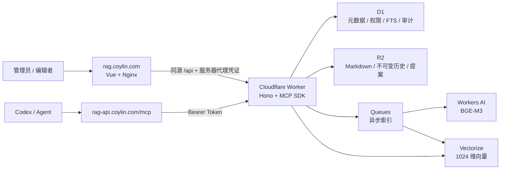

# Knowledge Core

一个面向 Codex、Claude Code 等 AI Agent 的私有 Markdown 知识中枢。

Knowledge Core 不是“上传文档后聊天”的成品 RAG 应用。它负责长期知识的存储、版本、权限、检索、审核与审计，并通过远程 MCP 把可靠上下文交给 Agent；回答和推理由 Agent 自己完成。

- 管理端：[rag.coylin.com](https://rag.coylin.com)
- MCP / API：[rag-api.coylin.com](https://rag-api.coylin.com)
- 正文格式：UTF-8 Markdown + YAML frontmatter
- 后端：Cloudflare Workers、D1、R2、Vectorize、Queues、Workers AI
- 前端：Vue 3、TypeScript、Vite，静态部署到香港服务器

> 当前代码状态（2026-08-23）：全部五项安全增强（回收站、最高权限 Token 风控、版本差异回滚、来源治理和批量导入导出）已完成开发并部署到生产。

## 为什么做这个项目

Agent 经常需要知道“我是谁、项目做到哪里、有哪些约束、过去做过什么决定”。把这些信息散落在聊天记录、Obsidian、代码仓库和临时文件中，会导致上下文难找、版本不明、来源不可追溯。

Knowledge Core 将这些信息整理为可治理的 Markdown：

- 人通过网页创建、编辑、审核和恢复知识；
- 普通 Agent 只能搜索、读取或提交待审核记忆；
- 受信任 Agent 可以使用短期最高权限 Token 直接维护知识；
- 每次写入都有版本锁、身份归因和审计记录；
- RAG 是检索能力，MCP 是 Agent 的标准接入层。

## 已实现能力

| 能力 | 当前实现 |
| --- | --- |
| Markdown 管理 | 知识库、文档、标签、草稿/发布、预览和版本恢复 |
| 混合检索 | D1 FTS5 + Vectorize + RRF，可选 OpenAI 兼容 Rerank |
| MCP 读取 | 列知识库、列文档、读取全文、最近变更、混合搜索和 `kb://` Resource |
| Agent 记忆 | 普通 Token 提交提案，管理员审核后才进入正式知识 |
| Agent 直写 | `knowledge:admin` 可维护知识库和 Markdown，但不能管理账号、成员或 Token |
| 可恢复删除 | 文档和知识库进入回收站，正常 API、搜索和 MCP 不再可见，可按并发保护恢复 |
| Token 风控 | 最高权限 Token 强制过期、请求/写入限额、IP 网段审计、用量统计和紧急批量撤销 |
| 幂等写入 | 最高权限 MCP 写操作使用 `operation_id`，安全处理断网重试和重复提交 |
| 权限与审计 | Viewer / Editor / Admin、知识库范围 Token、乐观锁和不可变审计事件 |
| 管理体验 | 站内登录、桌面和 375 px 移动端响应式界面、索引任务和失败重试 |

## 架构



存储职责严格分开：

- R2 是 Markdown 正文与历史版本的事实来源；
- D1 保存元数据、权限、FTS、任务、Token 哈希、用量和审计；
- Vectorize 保存语义向量；
- Queue 将保存文档与耗时索引解耦；
- R2、D1 和 Vectorize 均不提供绕过 Worker 权限检查的公共读取入口。

## 目录结构

```text
src/
  shared/                 # 前后端共享契约与 Markdown 规则
  web/                    # Vue 管理端
  worker/                 # Worker API、MCP、Queue、Cron 与服务层
migrations/               # D1 migrations
tests/
  e2e/                    # Playwright 桌面/移动端流程
  web/                    # Vue 组件与交互测试
deploy/
  nginx/                  # 裸机 Nginx 配置
  server/                 # 香港服务器容器化部署模板
```

完整架构、边界和验收要求见 [PLAN.md](./PLAN.md)，五项安全增强见 [ROADMAP_5_FEATURES.md](./ROADMAP_5_FEATURES.md)。

## 本地开发

### 环境要求

- Node.js 22+
- pnpm 10
- 可用的 Wrangler CLI
- 首次运行 Playwright 时需要安装 Chromium

### 启动

```powershell
corepack enable
pnpm install
Copy-Item .dev.vars.example .dev.vars
pnpm db:migrate:local
pnpm dev
```

打开 [http://localhost:5173](http://localhost:5173)。开发配置默认启用 `DEV_AUTH_BYPASS`，仅供本机使用；生产环境必须关闭。

## Markdown 规范

每篇文档都使用 YAML frontmatter：

```markdown
---
title: Knowledge Core 项目状态
tags:
  - project
  - knowledge-core
status: published
source: human
---

# 当前状态

这里写正文。
```

主要约束：

- `title` 必填，`status` 只能为 `draft` 或 `published`；
- 标签最多 20 个，单篇 Markdown 最大 2 MiB；
- `id`、`version` 和更新时间由服务端维护，不信任客户端伪造值；
- 当前正文位于 `notes/{collectionId}/{noteId}/current.md`；
- 历史正文位于 `versions/{collectionId}/{noteId}/{version}.md`。

## 连接 Codex MCP

创建 Token 时按最小权限选择 scope：

- `knowledge:read`：搜索和读取正式知识；
- `memory:propose`：提交待人工审核的记忆提案；
- `knowledge:admin`：受信任 Agent 直接维护知识，必须使用短期 Token。

先把明文 Token 放进本机环境变量：

```powershell
$env:KNOWLEDGE_CORE_MCP_TOKEN = "kcore_..."
```

在 Codex 配置中加入：

```toml
[mcp_servers.knowledge_core]
url = "https://rag-api.coylin.com/mcp"
bearer_token_env_var = "KNOWLEDGE_CORE_MCP_TOKEN"
startup_timeout_sec = 20
tool_timeout_sec = 60
```

基础工具：

| 工具 | 用途 |
| --- | --- |
| `list_collections` | 列出 Token 可访问的知识库 |
| `list_notes` | 按标签、更新时间和状态列文档 |
| `read_note` | 读取当前完整 Markdown |
| `search_knowledge` | 关键词与语义混合检索 |
| `list_recent_changes` | 增量同步最近变更 |
| `propose_memory` | 提交待审核记忆 |

`knowledge:admin` 额外提供：

- `create_collection`、`update_collection`、`trash_collection`、`delete_collection`、`restore_collection`；
- `create_note`、`update_note`、`delete_note`、`restore_note`。

所有最高权限写工具都要求 UUID 格式的 `operation_id`。同一个 Token 使用相同 `operation_id` 和相同输入重试时会回放原结果；改变输入复用该 ID 会被拒绝。文档也可通过 `kb://collections/{collectionId}/notes/{noteId}` Resource 读取。

## 安全模型

### 人类账号

| 角色 | 权限 |
| --- | --- |
| Viewer | 查看知识和审计信息 |
| Editor | 创建、编辑、发布和恢复文档 |
| Admin | 管理知识库、成员、Token 和审核流程 |

### 最高权限 Agent Token

- 只有 bootstrap 管理员可以签发；
- 必须设置 5 分钟到 7 天的有效期，界面默认 24 小时；
- 默认限制为每分钟 60 次请求、每小时 30 次写入，可在签发时收紧或调整；
- 只记录 IPv4 `/24` 或 IPv6 `/64` 网段，不保存完整客户端 IP；
- 记录请求、写入、失败、限流和 IP 网段变化；
- bootstrap 管理员可以一键撤销全部最高权限 Token；
- 即使拥有 `knowledge:admin`，也不能管理人类账号、成员或其他 Token。

Token 明文只在创建时返回一次，D1 只保存 SHA-256 哈希。生产密钥使用 `wrangler secret put` 写入，不要提交到 Git。

## 测试与构建

```powershell
pnpm test             # Worker/API/MCP 集成测试
pnpm test:web         # Vue 组件和交互测试
pnpm typecheck        # Vue 与 Worker TypeScript 检查
pnpm build            # 前端构建 + Worker dry-run
pnpm test:e2e         # Playwright 桌面与移动端流程
pnpm deploy:check     # 部署配置和生产安全检查
```

当前本地验收基线：

- Worker/API/MCP：47 / 47；
- Web：16 / 16；
- Playwright：桌面和移动端 2 / 2；
- TypeScript、Vite 构建、Web 产物校验、Wrangler dry-run 和部署配置检查均通过。

如果 Windows 用户目录包含非 ASCII 字符导致 `workerd` 无法启动，可临时把 `TEMP` 和 `TMP` 指向纯 ASCII 路径后再运行测试。

## Cloudflare 资源

生产配置使用：

- Worker：`knowledge-core`
- R2：`knowledge-core-notes`
- D1：`knowledge-core-db`
- Vectorize：`knowledge-core-v1`，metadata index 为 `collection_id`
- Queue：`knowledge-core-index`
- DLQ：`knowledge-core-index-dlq`
- Workers AI：默认 `@cf/baai/bge-m3`
- 可选 Rerank：OpenAI 兼容 `/v1/rerank` 端点

## 部署

### Worker

```powershell
pnpm deploy:check
pnpm test
pnpm typecheck
pnpm build
pnpm db:migrate:remote
pnpm deploy
```

`db:migrate:remote` 会修改生产 D1，执行前必须确认目标账号、数据库和备份策略。生产 Secret 至少包括：

- `SESSION_SECRET`
- `ADMIN_PASSWORD_HASH`
- `SERVER_PROXY_TOKEN`
- 可选的 `RERANK_API_KEY`

### Vue / Nginx

```powershell
pnpm build:web
tar -czf knowledge-core-web.tar.gz -C dist .
```

将静态产物上传到香港服务器后，由 Nginx 托管 `rag.coylin.com`，并把同源 `/api` 代理到 Worker。参考 [deploy/nginx](./deploy/nginx) 和 [deploy/server](./deploy/server)。DNS 记录保持 DNS only；Cloudflare Worker 自定义域负责 `rag-api.coylin.com`。

## 路线图

- [x] 可恢复删除与回收站
- [x] 最高权限 Token 风控
- [x] 版本差异与定点回滚
- [x] 来源、有效期与过期知识治理
- [x] 可恢复的批量导入与导出

开源产品差距分析见 [OPEN_SOURCE_GAP.md](./OPEN_SOURCE_GAP.md)，产品调试与问题记录见 [tech.md](./tech.md)。

## 项目边界

- 正文只存 Markdown，不演变为富文本或聊天内容仓库；
- 不在产品内实现面向终端用户的 AI 对话；
- 普通 Agent 默认不能直接改正式知识，只能提交提案；
- 不自动接受 Agent 写入，最高权限必须由人主动、短期签发；
- MCP 的“删除”始终可恢复，不提供物理删除工具；
- Cloudflare 免费额度和产品限制会变化，正式扩容前应以最新官方文档为准。
