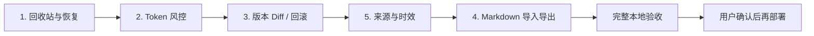

# Knowledge Core 五项增强实施计划

> 状态：规划完成；功能一已在当前分支本地实现并进入验收，尚未部署<br>
> 规划基线：`ca26f69 feat: add trusted agent knowledge admin token`<br>
> 目标场景：个人 Markdown AI 大脑，Codex 等 Agent 通过 MCP 使用，Cloudflare Workers + D1 + R2 + Vectorize + Queues 承载后端

## 1. 本轮目标

本计划覆盖五项能力：

1. 回收站与灾难恢复。
2. 最高权限 Token 风控。
3. 版本 Diff 与一键回滚。
4. Markdown 批量导入导出。
5. 来源与知识时效字段。

这五项不是并列堆功能。它们共同解决一个问题：允许受信任 Agent 直接维护知识后，系统必须确保误操作可恢复、凭证可控制、变更可理解、知识可迁移、旧信息会发出警告。

## 2. 已确定的产品边界

- 普通 Token 仍然只读或提交提案；只有 `knowledge:admin` 可以直接维护正式知识。
- Agent 可以软删除和恢复知识，但不能执行不可逆物理清除。
- 知识库物理清除只能由网页登录的人类 bootstrap 管理员执行，并且必须先完成可验证导出。
- 不自动清理正式 Markdown 历史版本；R2 成本不是当前主要矛盾。
- D1 Time Travel 作为 30 天内的数据库级最后防线，但不能代替应用回收站，也不能恢复已从 R2 物理删除的 Markdown。
- R2 生命周期规则只用于清理临时导入文件，不应用于 `notes/`、`versions/` 和回收站中的正式知识。
- 本轮不做 PDF/OCR、聊天 UI、知识图谱、Gmail/Slack 连接器和实时 Obsidian 双向同步。
- 不在五项功能完成并通过本地验收前部署生产环境。

## 3. 实施依赖与顺序

虽然需求编号中导入导出排在来源字段之前，实际实施必须先完成来源字段，否则导入功能会立刻面临第二次迁移。



推荐使用分支 `codex/knowledge-safety-roadmap`，每项能力一个可独立回滚的本地提交，不把五项压成一次大改动。

## 4. 跨功能数据设计

预计新增以下迁移；最终编号以实现时仓库最新迁移为准。

| 迁移 | 主要变化 | 兼容原则 |
| --- | --- | --- |
| `0005_recycle_bin.sql` | 知识库 `trashed_at/trashed_by/trash_reason/purge_after`；文档 `deleted_from_status/deleted_by/delete_reason`；回收站索引 | 复用已有 `notes.deleted_at`，先加可空列，再改变查询和删除语义 |
| `0006_token_controls.sql` | Token 限额、最近 IP 网段；按日用量、速率窗口和 Agent 写操作幂等回执表 | 现有普通 Token 使用安全默认值 |
| `0007_note_provenance.sql` | 来源 JSON、观察时间、人工复核时间、下次复核时间、替代关系、外部路径和同步基线哈希 | 旧文档全部允许字段为空 |
| `0008_transfer_jobs.sql` | 导入/导出任务、文件项、冲突、执行状态、备份 manifest 哈希与本地验证回执 | 传输任务与正式知识写入解耦，不导出登录或 Token 凭证 |

所有迁移先在空 D1 和已有数据夹具上执行；生产部署顺序必须是“备份/检查 → 远程迁移 → Worker → 前端”，新列在旧 Worker 下应保持无害。

## 5. 功能一：回收站与灾难恢复

### 5.1 当前问题

- 文档删除已经把 `notes.status` 设为 `deleted`，R2 历史仍保留，但没有回收站列表和恢复删除文档的入口。
- 知识库删除会立即清理 Vectorize/D1 chunks、R2 当前文件、全部历史版本和提案，然后删除 D1 记录。
- 精确输入标题/名称只能防止手滑。失窃的最高权限 Token 可以先读取名称，再完成确认，因此它不是灾难恢复措施。

### 5.2 目标行为

#### 文档

- `delete_note` 继续是软删除：退出正常列表、搜索、资源读取和 Agent 最近变更。
- 回收站保留标题、原 `draft/published` 状态、版本、删除者、删除时间和原因；原状态写入 `deleted_from_status`，不能靠历史版本猜测。
- 人类 Editor/Admin 与 `knowledge:admin` Token 都能恢复自己有权管理的文档。
- 恢复不覆盖历史：恢复当前 R2 Markdown，恢复原 `draft/published` 状态，重新排队索引并写审计。
- 第一版不提供单篇文档物理清除；历史长期保留。

#### 知识库

- 当前“永久删除”改为“移入回收站”，不再立即删除 D1/R2/历史版本。
- 被删除知识库立即从普通列表、搜索、MCP Resource 和所有读写操作中消失。
- 成员、文档、历史版本和提案保持原样；恢复后仍保留原权限。
- 恢复知识库后，只对原来 `published` 的文档重建索引。
- `knowledge:admin` 只暴露 `trash_collection`/`restore_collection`，不暴露 purge 工具。
- 原 `delete_collection` 在部署前改为兼容别名并返回 `trashed: true`，文档明确标注它不再物理删除。

### 5.3 物理清除策略

物理清除不在功能一立即开放。只有功能四的完整导出完成后，才增加人类专用 purge：

- 知识库已进入回收站至少 30 天。
- 没有未处理的导入任务和待审核提案。
- 所有范围 Token 已撤销或移除该知识库。
- 存在删除之后生成且校验成功的完整导出清单。
- bootstrap 管理员重新输入登录密码和知识库精确名称。
- purge 先写审计，再分批删除 Vectorize、D1 索引和 R2 对象；失败可继续，不把部分完成误报为成功。

不做自动 Cron purge。`purge_after` 只表示“最早允许清除时间”。

### 5.4 API、MCP 与 UI

管理 API：

- `GET /api/v1/trash/collections`
- `GET /api/v1/trash/notes?collectionId=...`
- `POST /api/v1/notes/:noteId/restore-deleted`
- `POST /api/v1/collections/:collectionId/trash`
- `POST /api/v1/collections/:collectionId/restore`
- `POST /api/v1/trash/collections/:collectionId/purge` 延迟到功能四完成后加入，并要求密码、精确名称、完整灾备任务 ID 和本地验证回执

MCP：

- `delete_note`：软删除，返回 `deletedAt` 和恢复提示。
- `restore_note`：要求当前删除版本，避免恢复期间状态变化。
- `trash_collection`：要求 `expected_updated_at` 与精确名称。
- `restore_collection`：要求回收站中最后观察的删除时间。
- 不注册任何 R2/D1 物理清除 Tool。

网页：

- 知识页增加“回收站”入口，不新增主导航产品模块。
- 文档与知识库分别显示恢复操作、删除时间和操作者。
- 原“永久删除”文案改成“移入回收站”。
- purge 上线后放在危险区域，与普通删除明显分离。

### 5.5 查询与权限不变量

- 所有正常知识库列表、成员授权、文档读取、搜索、任务、提案和审计筛选都必须显式要求 `collections.trashed_at IS NULL`。
- `knowledge:admin` 的“覆盖全部知识库”枚举默认只返回活动知识库；只有回收站专用查询和恢复 Tool 可以读取已回收对象。
- 回收站查询走独立的角色校验路径。原成员可看自己有权管理的回收项，但普通接口用 UUID 猜测时仍统一返回不泄漏存在性的错误。
- 知识库进入回收站时更新 `updated_at`；移入和恢复都要求客户端最后读取的 `updated_at/trashed_at`，避免并发操作覆盖。

### 5.6 验收标准

- 删除后正常 API、搜索、MCP 与 Resource 均不可读取该对象。
- 回收站授权严格跟随原知识库角色；猜测 UUID 不泄漏标题或正文。
- 文档恢复后版本不倒退，发布文档重新进入索引，草稿仍不可被普通 Token 搜索。
- 知识库恢复后成员和全部 Markdown 仍在。
- 最高权限 Token 无法通过任何 MCP Tool 触发物理清除。
- 对照 D1 Time Travel 文档记录生产恢复手册，但不把整库 Time Travel 当作日常撤销按钮。

## 6. 功能二：最高权限 Token 风控

### 6.1 签发策略

- 新建 `knowledge:admin` Token 必须设置到期时间。
- UI 默认 24 小时；服务端允许 5 分钟至 7 天，不允许永久最高权限 Token。
- 普通 Token 可以维持现有可选过期规则。
- 部署前检查并拒绝活动的永久 `knowledge:admin` Token；如已存在，先撤销后重新签发。

### 6.2 限额与用量

`api_tokens` 增加可配置限额：

- `max_requests_per_minute`：默认 60。
- `max_writes_per_hour`：最高权限默认 30。
- `last_ip_prefix`：只保存 IPv4 `/24` 或 IPv6 `/64` 网段，不保存完整地址。
- `last_ip_changed_at`：识别凭证突然换网段。

新增汇总表：

- `token_rate_windows`：原子累计分钟请求和小时写入窗口；旧窗口由 Cron 清理。
- `token_usage_daily`：请求、读取、搜索、提案、写入、失败、限流次数和最近使用时间。

第一版只对 `knowledge:admin` 同步执行强制请求/写入限额，避免普通只读检索为每次请求制造 D1 写放大；普通 Token 仍记录现有 `last_used_at`，后续再按实际用量决定是否扩展同级统计。请求预算在认证后消耗；写入预算在具体 MCP 写工具执行前消耗。失败写入也消耗写预算，防止恶意反复试错。超过限制返回 `429` 和可机器读取的 `retryAfterSeconds`。

最高权限 MCP 写 Tool 统一增加必填 `operation_id` UUID。`token_mutation_receipts` 以 `token_id + operation_id` 唯一，保存 Tool 名、输入哈希和不含正文的结果摘要：同一 ID、同一输入的网络重试返回原结果；同一 ID 换输入直接拒绝。回执保留 7 天后由 Cron 清理，避免 `create_collection/create_note` 因客户端重试生成重复对象。

### 6.3 异常提示与撤销

- 最高权限 Token 首次从新 IP 网段执行写操作时，写 `token.ip_changed` 审计事件。
- 短时间连续版本冲突、删除失败或限流写 `token.anomaly`，网页显示安全提醒。
- 第一版只做站内提醒和审计，不接邮件、短信或第三方告警。
- Token 页面展示今日请求/写入、最近网段、到期倒计时和最近异常。
- 增加 bootstrap 专用“撤销全部最高权限 Token”紧急按钮和 API。
- 已有单 Token 一键撤销继续保留。

管理 API 固定为：

- `GET /api/v1/tokens/:tokenId/usage?days=7`：bootstrap 管理员读取用量和异常摘要。
- `POST /api/v1/tokens/revoke-knowledge-admin`：撤销全部活动 `knowledge:admin` Token；路由必须注册在动态 `/:tokenId` 路由之前。

### 6.4 工程约束

- 使用 D1 binding，不从 Worker 内调用 Cloudflare REST API。
- 不在模块全局保存计数器，避免跨 isolate/请求状态错误。
- 用 D1 原子 upsert 更新窗口，不能采用“先读再写”的竞态实现。
- 限额判断与计数必须在单条带条件的 SQL 中完成并返回结果；不能先查询计数再单独更新。
- 幂等回执先占位、业务写入后完成；处理中断时允许按审计和目标资源收敛，不能把“已有占位但没有成功结果”当作成功。
- 用量统计失败时最高权限写操作应失败关闭；认证本身已经依赖 D1，不额外引入新的单点依赖。
- 日志和错误响应不得输出完整 Token、完整 IP 或正文。

### 6.5 验收标准

- 非 bootstrap 管理员无法创建、查看、调整或批量撤销最高权限 Token。
- 最高权限 Token 无过期时间或超过 7 天时服务端拒绝，而不是只依赖 UI。
- 并发请求不能绕过请求/写入上限。
- 最高权限 MCP 写请求因断网重试时，同一 `operation_id` 最多产生一次逻辑变更；复用 ID 但篡改参数会被拒绝。
- 被限流、过期、撤销的 Token 不改变知识数据。
- IP 网段变化只触发一次明确事件，不产生每次请求的审计噪音。
- 紧急撤销后所有活动最高权限 Token 下一次请求立即返回 `401`。

## 7. 功能三：版本 Diff 与一键回滚

### 7.1 API

- `GET /api/v1/notes/:noteId/versions`：保留现有版本列表。
- `GET /api/v1/notes/:noteId/versions/:version`：读取指定版本完整 Markdown，带 ETag 和权限检查。
- `POST /api/v1/notes/:noteId/restore`：继续创建新版本，但必须携带当前文档 `If-Match`。
- 已删除文档使用功能一的恢复接口，不混用“恢复历史版本”和“从回收站恢复”。

### 7.2 Diff 规则

- 前端按需获取两个版本，在浏览器中计算行级 Diff，避免大型 Markdown 在 Worker 中消耗过多 CPU。
- frontmatter 与正文分开显示：标题、标签、状态、来源、时效字段使用结构化摘要；正文使用增删行 Diff。
- 桌面默认双栏，移动端默认统一单栏。
- 忽略服务端自动变化的 `version` 行，但保留 `id` 一致性检查。
- Diff 只渲染文本，不执行 Markdown HTML，防止历史内容借 Diff 绕过 DOMPurify。
- 超大 Diff 分段/虚拟化，不能一次向 DOM 插入 2 MiB 的逐字符节点。

### 7.3 MCP

普通读 Token：

- `list_note_versions`
- `read_note_version`

最高权限 Token：

- `restore_note_version`，要求 `expected_version` 和 `source_version`。

第一版不增加 MCP 服务端 Diff Tool；Agent 可读取两个版本自行比较，避免把大 Diff 强塞进上下文。

### 7.4 回滚语义

- 回滚永远生成 `N+1` 新版本，不覆盖或删除任何历史。
- 回滚保存操作者、来源版本和当前版本到审计 metadata。
- 当前版本与用户打开页面时不一致则返回 `409`，必须重新查看 Diff。
- 第一版只做单篇文档回滚，不承诺跨多个文档的一键事务回滚。

### 7.5 验收标准

- Viewer 可以看版本和 Diff，不能回滚；Editor/Admin 可以回滚。
- 无权用户和 Token 猜测版本 URL 时返回不泄漏资源存在性的错误。
- 两人并发时旧页面不能把新修改静默覆盖。
- 回滚后历史版本数量增加，R2 旧对象保持不可变，索引进入新版本。
- Markdown 中的脚本、事件属性和恶意 HTML 在 Diff 页面不会执行。

## 8. 功能五：来源与知识时效

### 8.1 Markdown frontmatter

扩展为可移植字段：

```yaml
source:
  type: manual
  uri: null
  label: 本人确认
  observed_at: 2026-08-10T00:00:00.000Z
review_after: 2026-11-10T00:00:00.000Z
reviewed_at: 2026-08-10T00:00:00.000Z
supersedes: []
```

规则：

- `source.type` 初期允许 `manual`、`agent`、`import`、`git`、`url`、`project`。
- `source.uri` 可为空，最大长度和协议受服务端校验，不允许 Secret 或带凭证 URL。
- `observed_at` 表示来源内容何时被观察，不等于系统保存时间。
- `review_after` 表示到期提醒时间；到期不是自动删除，也不是自动判定内容错误。
- `reviewed_at` 由人类 Editor/Admin 的“标记已复核”操作维护；Agent 不能直接伪造人工复核。
- `supersedes` 只接受同知识库文档 UUID，禁止指向自身，第一版只标记关系，不做自动图推理。
- `id`、`version`、导入 `external_path` 和同步基线哈希仍由服务端维护。

服务端解析 Markdown 时必须感知操作者类型：网页登录的人类复核流程可以更新 `reviewed_at`；`knowledge:admin` Token 提交完整 Markdown 时只能保留旧值或留空，若尝试改变该字段则拒绝整次写入并写审计，不能只在 D1 中忽略却把伪造值留在 R2 正文。

### 8.2 D1 与检索

`notes` 保存可查询副本：

- `source_json`
- `observed_at`
- `reviewed_at`
- `review_after`
- `supersedes_json`
- `external_path`
- `sync_base_hash`

时效在查询时计算，不额外保存容易漂移的 `stale=true`：

- `review_after IS NULL`：未设置复核要求。
- `review_after >= now`：当前。
- `review_after < now`：需要复核。

过期文档仍可检索，但 API/MCP 结果必须返回 `warnings: ["review_due"]`、来源和时间。Agent 使用过期项目状态或基础设施信息前应重新验证，不能静默当成当前事实。

### 8.3 UI 与 MCP

- 文档上下文面板展示来源、观察时间、最近复核、下次复核和替代关系。
- 知识页增加“待复核”筛选和数量提示。
- 人类 Editor/Admin 可“标记已复核”并选择下一次复核时间；该操作创建新的元数据版本和审计。
- 管理 API 增加 `GET /api/v1/collections/:collectionId/review-due` 和 `POST /api/v1/notes/:noteId/review`；复核写入必须携带当前文档 `If-Match`。
- MCP `search_knowledge`、`read_note`、`list_notes` 返回来源和时效警告。
- 新增只读 `list_review_due`，让 Agent 提醒人处理陈旧知识。
- Agent 可以更新来源观察时间和正文，但不能把 `reviewed_at` 标为人工已复核。

### 8.4 验收标准

- 旧 Markdown 不增加任何字段也能继续保存和读取。
- 导出后再导入，来源与时效字段不丢失。
- 过期文档仍可找到，但每个读取入口都明确提示需要复核。
- Agent 伪造 `reviewed_at` 时服务端忽略或拒绝，并记录清晰错误。
- `supersedes` 目标必须存在、同知识库且不能自引用。
- Secret 扫描测试覆盖常见 Token、Cookie、私钥和带用户信息 URL，阻止它们进入来源字段。

## 9. 功能四：Markdown 批量导入导出

### 9.1 为什么最后实施

导入需要稳定的外部路径、来源类型、同步基线哈希、回收站和版本冲突规则。先实现导入再补这些字段，会造成数据无法可靠去重和第二轮迁移。

### 9.2 导入架构

浏览器负责读取文件夹或 ZIP，Worker 不在单个请求中解压大型归档：

1. 用户选择文件夹/ZIP；前端仅接受 UTF-8 `.md`。
2. 第一版单任务最多 500 篇、单篇最多 2 MiB、解压后总计最多 100 MiB、规范化相对路径最多 512 字节；前端检查数量、大小、重复路径和危险路径。
3. 创建 `transfer_job`，逐篇把 Markdown 暂存到 `imports/{jobId}/files/{itemId}.md`。
4. Worker 对每篇再次执行 UTF-8、frontmatter、大小、路径和 Secret 校验，不能信任浏览器结果。
5. `plan` 阶段返回 `create`、`update`、`unchanged`、`conflict`、`invalid`，不修改正式知识。
6. 用户选择冲突处理后提交 `apply`。
7. 新增独立 `TRANSFER_QUEUE` binding；每条消息只应用一个文件，使用现有 `createNote/updateNote`、版本锁和 R2 版本，再把索引任务发送到现有 `INDEX_QUEUE`，避免大批导入阻塞正常索引消费。
8. 任务可中断后继续；重复消息通过 `jobId + itemId` 幂等。
9. 完成后写一条任务级审计和每篇文档的正常写入审计。

R2 为 `imports/` 前缀配置 7 天生命周期，只清理暂存文件。任务元数据和错误摘要保留更久，便于审计。

### 9.3 管理 API

导入：

- `POST /api/v1/collections/:collectionId/import-jobs`：创建任务并返回应用级上限。
- `PUT /api/v1/import-jobs/:jobId/items/:itemId`：逐篇上传暂存内容和客户端 SHA-256；服务端重新计算并校验。
- `POST /api/v1/import-jobs/:jobId/plan`：冻结本次上传集合并生成 dry-run。
- `POST /api/v1/import-jobs/:jobId/apply`：提交逐项冲突决策和 plan 版本，异步发送 Queue。
- `GET /api/v1/import-jobs/:jobId`：读取进度、逐项结果和可重试错误。
- `POST /api/v1/import-jobs/:jobId/cancel`：停止发送未开始项；已经落库的版本不回滚。

导出：

- `POST /api/v1/collections/:collectionId/export-jobs`：创建可移植导出或完整灾备任务。
- `GET /api/v1/export-jobs/:jobId/manifest`：分页/流式返回服务端权威 manifest。
- `GET /api/v1/export-jobs/:jobId/objects/:objectId`：按 manifest 读取单个私有对象，禁止客户端传任意 R2 key。
- `POST /api/v1/export-jobs/:jobId/verify`：bootstrap 管理员登记本地 `verify-backup` 报告摘要；服务端核对 manifest 哈希后写 `verified_at`。

所有传输 API 继续使用网页登录会话和知识库角色，不接受 MCP Bearer Token。任务状态变化使用版本号，重复 `plan/apply/cancel/verify` 必须幂等。

### 9.4 冲突判断

- 路径从未出现：`create`。
- 当前内容哈希等于导入内容：`unchanged`。
- 当前内容哈希等于上次同步基线、导入内容已变化：`update`。
- 当前内容与导入内容都偏离同步基线：`conflict`，默认不覆盖。
- 目标文档在回收站：`conflict_deleted`，不能偷偷创建同路径副本。
- 同一批次重复路径、非法 `..`、绝对路径、空文件和非 UTF-8：`invalid`。

冲突选项只允许：跳过、保留为新副本、明确覆盖当前版本。批量默认“跳过冲突”，不提供一键静默覆盖全部。

### 9.5 两种导出语义

导出必须明确分成两类，不能让普通 Markdown 搬运包冒充灾备：

- **可移植导出**：当前活动 Markdown + 来源字段，用于重新导入、Git/Obsidian 搬运；标准导入器只处理这部分。
- **完整灾备**：在可移植内容外加入回收站、全部不可变历史版本和恢复所需的非敏感元数据；只能由 bootstrap 管理员创建，用于本地恢复演练和物理 purge 前置证明。

完整灾备不包含管理员密码哈希、会话、MCP Token 哈希、第三方 API Key 或其他 Secret。成员关系只输出邮箱和角色的恢复清单，不自动恢复认证凭证。

### 9.6 导出格式

第一版由浏览器分页读取并生成 ZIP，避免 Worker 构建大型压缩包：

```text
knowledge-core-export/
  manifest.json
  collections/{collection-slug}/notes/{external-path-or-safe-name}.md
  history/{note-id}/{version}.md        # 勾选“包含历史版本”时
  recovery/collections.json             # 仅完整灾备
  recovery/notes.json                   # 仅完整灾备
  recovery/versions.json                # 仅完整灾备
```

`manifest.json` 至少包含：

- 格式版本。
- 导出时间和服务版本。
- 知识库 ID/名称。
- 每篇文档 ID、路径、当前版本、内容哈希、状态、来源和时效摘要。
- 是否包含回收站与历史版本。
- 完整灾备中每个恢复元数据文件和 R2 对象的 SHA-256、字节数与逻辑关联。

导出默认包含当前活动文档；用户可选择草稿、回收站和完整历史。完整灾备由服务端生成权威 manifest，浏览器逐项下载并校验哈希后生成 ZIP。仓库新增本地 `verify-backup` 脚本，把备份恢复到空 D1/R2 测试夹具并输出 manifest 哈希与验证报告；bootstrap 管理员确认报告后，服务端才记录 `verified_at`。只有“删除后生成 + 包含回收站和完整历史 + 本地恢复验证通过”的记录可作为知识库 purge 前置证明。

### 9.7 UI

- 知识库菜单增加“导入 Markdown”和“导出备份”。
- 导入分四步：选择 → 校验/上传 → 预览变更 → 执行/结果。
- 预览必须显示新增、更新、未变化、冲突、非法文件数量，并能展开到单篇。
- 移动端允许查看/确认任务，但文件夹/大 ZIP 选择以桌面端为主要场景。
- 导出显示进度、取消和失败重试；不把完整 ZIP 留在服务器。

### 9.8 MCP 边界

第一版不增加“大数组批量导入” MCP Tool。最高权限 Agent 已可逐篇 CRUD；批量导入是需要人预览冲突的管理流程。后续如确有自动化需求，只开放创建导入草案和读取计划，不允许 Agent 自动确认全量覆盖。

### 9.9 验收标准

- 100 篇混合新增/更新/冲突 Markdown 的任务可以暂停、重试并最终收敛，不重复创建版本。
- 单个坏文件不导致整个任务回滚或卡死，其余合法文件可继续。
- ZIP 路径穿越、重复路径、超限文件、非 UTF-8 和常见 Secret 被拒绝。
- 冲突默认不覆盖，过期 expected version 在 apply 时再次返回冲突。
- 可移植导出 ZIP 解压后全部当前 Markdown 可由同版本系统 dry-run 为 `unchanged`；标准导入器忽略并拒绝伪造的 `history/`、`recovery/` 保留路径。
- 完整灾备包含权威 manifest、回收站、所有历史版本和非敏感恢复元数据，并能由 `verify-backup` 在空本地数据库/R2 夹具中恢复和逐对象核对哈希。

## 10. 测试与验收矩阵

### Worker/D1/R2

- 每个迁移：空库执行、已有数据升级、重复检查、约束和索引验证。
- 回收站：删除不可见、权限隔离、恢复、集合恢复、索引恢复、无 MCP purge。
- Token：并发限流、到期边界、IP 网段变化、紧急撤销、无日志泄密。
- 版本：指定版本读取、ETag、并发回滚、R2 不可变对象。
- 来源：旧文档兼容、服务端字段、时效计算、替代关系约束。
- 导入：dry-run、上限、冲突、独立 Queue、幂等、失败重试、R2 暂存清理。
- 导出：可移植包往返、完整灾备哈希、敏感字段排除、空夹具恢复验证与 purge 回执门槛。

### Vue

- 回收站桌面/375 px 移动端操作。
- Token 到期和限额表单、异常提示、紧急撤销确认。
- 版本 Diff 大小控制、恶意 Markdown 文本安全。
- 来源字段、待复核筛选和人工复核。
- 导入四步流程、冲突选择、取消/恢复、导出进度。

### E2E

至少覆盖：

1. 创建文档 → Agent 修改 → 查看 Diff → 回滚。
2. Agent 删除文档/知识库 → 正常搜索不可见 → 人恢复。
3. 最高权限 Token 触发限流 → 人紧急撤销。
4. 导入含新增/更新/冲突的 Markdown → 只应用已确认项。
5. 文档到期 → 搜索/MCP 返回时效警告 → 人工复核消除警告。
6. 导出完整备份 → 新本地夹具 dry-run/恢复验证。

## 11. Git 与执行批次

实现开始前：

```text
ca26f69  当前安全基线
   └─ codex/knowledge-safety-roadmap
```

建议提交：

1. `feat: add recoverable knowledge trash`
2. `feat: enforce privileged token safety limits`
3. `feat: add note version diff and rollback`
4. `feat: add knowledge provenance and review dates`
5. `feat: add resumable markdown transfer jobs`
6. `test: complete knowledge safety e2e coverage`
7. `docs: finalize recovery and import runbooks`

每个功能提交前运行对应 Worker/Web 测试；最后统一运行完整测试、两套 TypeScript 检查、生产前端构建、Web 资源校验、Wrangler dry-run 和 Playwright。

## 12. 上线门槛与恢复预案

满足以下条件前不部署：

- 五项功能全部完成，不把未实现的 purge/备份文档写成已完成。
- 所有迁移在空库和生产数据副本上通过。
- 完整 Worker/Web/E2E/构建检查通过。
- 生产活动最高权限 Token 已清点，无永久 Token。
- 确认 D1 数据库使用支持 Time Travel 的生产存储版本，并记录当前 bookmark/恢复命令。
- 完成一次包含回收站和历史版本的本地导出恢复演练。
- R2 生命周期规则只匹配 `imports/` 临时前缀。
- 部署后先使用新签发的短期测试 Token 做读、写、删除、恢复和撤销验收，再交给日常 Agent。

若上线后异常：

1. 立即撤销全部最高权限 Token。
2. 禁用写工具或回滚 Worker 到上一部署。
3. 保留 R2，不执行 purge。
4. 依靠审计定位受影响文档，使用版本回滚/回收站恢复。
5. 只有 D1 元数据损坏时才使用 Time Travel；先恢复到新数据库验证，不直接覆盖生产。

## 13. 工作量判断

按当前仓库基础，功能一到三属于安全增量；功能四是最大工作量，功能五是导入的前置数据设计。合理拆分为：

- 回收站与恢复：中等。
- Token 风控：中等。
- 版本 Diff/回滚：中等偏小。
- 来源与时效：中等。
- 可恢复导入导出：较大，约占五项总工作量的三分之一到一半。

如果需要缩小第一轮范围，也只能推迟“物理 purge”和“包含全部历史的完整导出”，不能推迟软删除恢复、最高 Token 强制过期、版本并发回滚和导入冲突保护。
